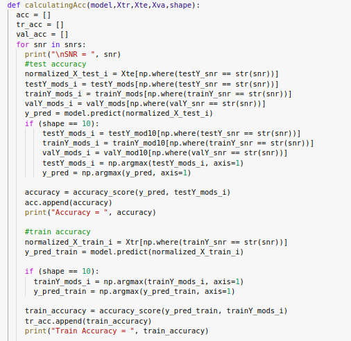
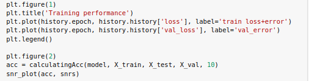
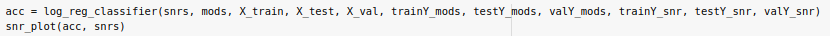

**Data Mining**
**6th January 2021**

# Modulation Classification

# **Problem statement**

A synthetic dataset, generated with GNU Radio, consisting of 11 modulations. This is a variable-SNR dataset with moderate LO drift, light fading, and numerous different labeled SNR increments for use in measuring performance across different signal and noise power scenarios.
# **1. Download Data**
We download data from this link <http://opendata.deepsig.io/datasets/2016.10/RML2016.10b.tar.bz2>

# **2. Loading Data**
We use cPickle library to read data from the file as we find that it’s the easiest way to do that.

# **3. Create feature spaces**
` `Each feature is calculated on the fly to avoid RAM failure using only the source X which is the data, we have obtained 6 features, the first is the raw of X, the second is first derivative in time, the third is the integral in time, the fourth is the  combination between raw x and the first derivative in time, the fifth is the combination between the the raw x and the integral in time, the sixth is the combination between the first derivative in time and integral in time & the combination seventh combination is the combination of the three features.

NB: the RAM can’t bear the 5th, 6th & 7th features

# **4. Supervised learning step**
## **1 - Splitting Data**
Function of split data takes the X and Y parameters as inputs.
Split the data into 70% for training and 30% for testing, then split the train to 95% for train and 5% for validation.
Split the labels in the train, validation and test to modulations and SNRs.
Convert the train, test and validation labels into new form to be used in CNN and Full Dense 

## **2 - Flatten Data**
Flatten the train, test and validation of X to be in the form n \* m instead of n \* m \* k to be used in the first three classifiers.

## **3 - Confusion Matrix Plotting**
Take the confusion matrix and mods, then plot the confusion matrix for each SNR.

## **4 - SNRs plotting**
Take the test accuracy and SNRs, then plot between them.

## **5 - Calculating accuracy for each SNR**
Take the model, train\_x, test\_x, val\_x, shape of labels as parameters.
Calculate the test, train, validation and average accuracies for each SNR.
Calculate the confusion matrix and plot it, then return the test accuracy.

****
## **6 - logistic regression**
Take snrs, mods, X\_train, X\_test, X\_val, trainY\_mods, testY\_mods, valY\_mods, trainY\_snr, testY\_snr, valY\_snr as parameters.

Used logistic regression with max iteration 1000.
Normalized the X\_train, x\_test and x\_val by minmax scaler.
Fit the model, then calculate accuracy.
Return the accuracy.

## **7 - Decision Tree**
Take snrs, mods, X\_train, X\_test, X\_val, trainY\_mods, testY\_mods, valY\_mods, trainY\_snr, testY\_snr, valY\_snr as parameters.

Used Decision tree classifier.
Fit the model, then calculate accuracy.
Return the accuracy.

## **8 - Random Forest**
Take snrs, mods, X\_train, X\_test, X\_val, trainY\_mods, testY\_mods, valY\_mods, trainY\_snr, testY\_snr, valY\_snr as parameters.

Used Random forest classifier with n\_estimaor = 100 and n\_jobs = 1.
Fit the model, then calculate accuracy.
Return the accuracy.

## **9 - Fully connected dense layer**
` `Full-dense function is to build a model consisting of only two dense layers, first use ReLu activation function and the last use softmax activation function.
Then we train this model and use early stopping.
Then it plots the results, acc, confusion matrix and snr graph.

****
## **10 - CNN**
We implement a function which builds the CNN model, It’s architecture as in PDF of assignment and adding some dropout layers to the model, dr = 0.5.
Using ADAM optimizer and loss function is cross entropy.
Then we train this model and use early stopping.
Then it plots the results, acc, confusion matrix and snr graph.
Its parameters are train, validation and test data.

****
# **5. Big picture**
We used this to train each of the five classifiers.

Results can be found in the note books attached in the ink of the drive.

**Modulation\_classifiaction**

It is the main notebook.

**Version(1)\_Train\_Modulation\_classifiaction**

It is the notebook that contains the results for X.

**Version(2)\_Train\_Modulation\_classifiaction**

It is the notebook that contains the results for the derivative of X.

**Version(3)\_Train\_Modulation\_classifiaction**

It is the notebook that contains the results for integration of X.

**Version(4)\_Train\_Modulation\_classifiaction**

It is the notebook that contains the results for the combination of X and derivative of X.
